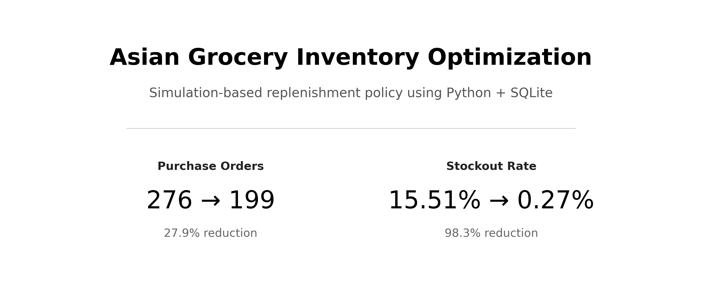
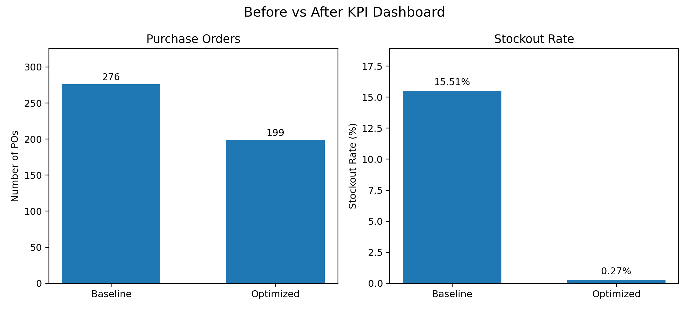

# Grocery Inventory Management System

<p align="center">
  
</p>

<p align="center">
  <em>Data-driven replenishment optimization under demand and lead-time uncertainty</em>
</p>

## Project Overview
This project stimulates an inventory and replenishment management system for an Asian grocery store in 2025, in Germany.

Many imported products often face business challenges such as:
- Uncertain supplier lead times
- Demand volatility (e.g., weekend/seasonal peaks, promotions)
- Risk of overstock and product expiration
- Inefficient replenishment

This system integrates SQL database design with Python simulation and analytics to support data-driven replenishment decisions. The goal is to help the management team minimize stockout risk while improving operational efficiency.

## System Architecture
1. SQL database
   - Products
   - Suppliers
   - Sales (simulated daily demand)
   - Inventory levels
   - Purchase orders
     
2. Python simulation & analytics
   - Demand simulation (randomness + seasonality + promotion)
   - Demand mean and variability calculation
   - Safety stock and reorder point calculation
   - Inventory simulation
   - Stockout and replenishment analysis
   - Strategy optimization

## System Flows

```text
Demand Generation (Python)
        ↓
Sales Data (SQLite)
        ↓
Baseline Inventory Simulation
        ↓
Automated Reorder / Purchase Orders
        ↓
Diagnostic Analysis
        ↓
Replenishment Policy Optimization
        ↓
Optimized Simulation
        ↓
Performance Comparison
```

## Key Metrics
- Daily demand mean and standard deviation
- Safety stock level
- Reorder point
- Stockout rate
- Purchase order quantity

## Key Results
<p align="center">
  
</p>

<p align="center">
  <em>Comparison of Purchase Orders and Stockout Rate under the optimized replenishment policy</em>
</p>

- The optimized policy reduces purchase orders by 27.9% while lowering the stockout rate from 15.51% to 0.27%
- The optimization balances inventory efficiency and service level through dynamic adjustment of reorder quantities
  
## Key Insights
### 1. High-Risk Products Improved Stockout Rate Significantly
- Frozen Dumplings: **63.8% → 1.6%**
- Kimchi: **55.6% → 0.8%**
- Hot Pot Soup Base: **50.4% → 1.3%**

These products originally faced **long supplier lead time** & **undersized reorder quantities**.

### 2. Moderate Concerns Fully Resolved
- Pineapple Cake: **25.5% → 0%**
- Thai Jasmine Rice: **24.9% → 0%**
- Korean BBQ Sauce: **12.1% → 0%**

Optimized batch sizes to eliminate stockouts.

### 3. Stable Products Remained Efficient
- Sushi Rice
- Miso Paste  
- Soy Sauce
   
No unnecessary strategy changes were made.

<p align="center">
  
</p>

<p align="center">
  <em>Stockout reduction across key SKUs (stock keeping unit), with the largest improvements observed in high demand and long lead-time products</em>
</p>

## Methodology
### Demand Model
Demand = base demand × seasonality effect × weekend effect × promotion effect + random noise

### Inventory Model
Reorder Point = μ × L + Z × √(Lσ² + μ²σ_L²)
- μ: mean daily demand
- L: mean supplier lead time
- Z: service level factor (z-score)
- σ: standard deviation of daily demand
- σ_L: standard deviation of lead time

### Optimization Logic
- Increase batch size for high stockout SKUs
- Adjust reorder quantity when ROP is too high
- Slightly increase batch size for frequently ordered items
- Keep stable products unchanged

## Key Takeaways
1. Small reorder quantities may lead to **high stockout** and **frequent reordering**
2. Demand variability must be taken into account in inventory decisions
3. Data-driven and rule-based optimization can bring significant business improvements

## Reproducibility & Setup
This project is designed for full reproducibility from scratch. The user does not need the original database to get started. The pipeline is script-driven as follows:
1. Schema: Initialize the SQLite database using sql/schema.sql
2. Master data: Seed static entities (e.g., Products, Vendors) using sql/seed.sql
3. Demand Generation: Create synthetic transaction data using src/generate_sales_data.py
4. Baseline: Execute the simulation to establish current KPIs
5. Optimization: Run the ROP policy scripts for improvement comparison

Note: By changing parameters in the generation scripts, the user can simulate different years or demand volatility scenarios.
