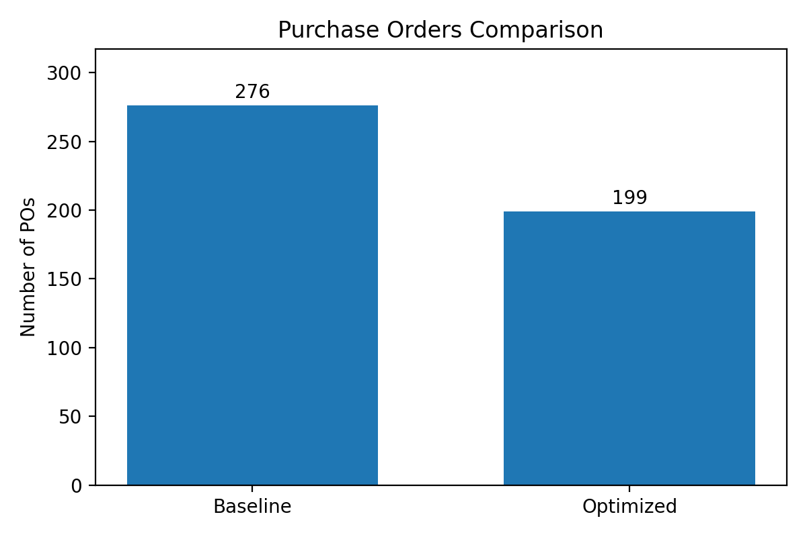

# Grocery Inventory Management System

## Project Overview
This project stimulates an **inventory and replenishment management system** for an Asian grocery store in 2025, in Germany.

Many imported Asian products often face challenges such as:
- Long supplier lead times
- Demand fluctuations (weekend/seasonal peaks)
- Out of stock or overstock

This system integrates SQL database design with Python simulation and analytics to support data-driven replenishment decisions. The goal is to help the management team minimize stockout risk while improving operational efficiency.

## Observed Business Problem
- Uncertain supplier lead times
- Demand volatility (e.g., weekend/seasonal peaks, promotions)
- Risk of overstock and product expiration
- Inefficient replenishment (too frequent reordering)

## System Architecture
1. SQL database
   - Products
   - Suppliers
   - Sales (simulated daily demand)
   - Inventory levels
   - Purchase orders
     
2. Python simulation & analytics
   - Demand simulation (randomness + seasonality + promotion)
   - Demand mean and variability calculation
   - Safety stock and reorder point calculation
   - Inventory simulation
   - Stockout and replenishment analysis
   - Strategy optimization

## System Flows
1. Demand Generation (Python)
2. Sales Data (SQLite)
3. Inventory Simulation (Baseline)
4. Purchase Orders Automation (reorder)
5. Diagnostic Analysis
6. Replenishment Optimization
7. Performance Comparison

## Key Metrics
- Daily demand mean and standard deviation
- Safety stock level
- Reorder point
- Stockout rate
- Purchase order frequency

## Key Results
### Purchase Orders

- Baseline: **276**
- Optimized: **199**
- Improvement: **27.9% fewer purchase orders**

### Stockout Rate

- Baseline: **15.51%**
- Optimized: **0.27%**
- Improvement: **98% lower stockout rate**
  
## Key Insights
### 1. High-Risk Products Improved Stockout Rate Significantly
- Frozen Dumplings: **63.8% → 1.6%**
- Kimchi: **55.6% → 0.8%**
- Hot Pot Soup Base: **50.4% → 1.3%**

These products originally faced **long supplier lead time** & **under-sized reorder quantities**.

### 2. Moderate Concerns Fully Resolved
- Pineapple Cake: **25.5% → 0%**
- Thai Jasmine Rice: **24.9% → 0%**
- Korean BBQ Sauce: **12.1% → 0%**

Optimized batch sizes to eliminate stockouts.

### 3. Stable Products Remained Efficient
- Sushi Rice
- Miso Paste  
- Soy Sauce
   
No unnecessary strategy changes were made.

## Methodology
### Demand Model
Demand = base_demand x seasonality effect x weekend effect x promotion effect + random noise

